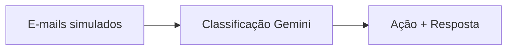

# Classificação de E-mails com IA (Relato de Implementação)

## 1) Configuração da API e chave segura
Nós priorizamos um fluxo sem credenciais no código-fonte. O `main.py` chama `load_dotenv()` e lê `GEMINI_API_KEY` antes de inicializar o cliente (`init_gemini()`), encerrando a execução se o valor não existir. Dessa forma, bastou criar um `.env` local (a partir do `.env.example`) com `GEMINI_API_KEY=***`. Não há commits com chaves reais e o README reforça a mesma prática. Falta apenas uma checagem automática em CI para lembrar sobre a variável (inferência).

Trecho ilustrativo:
```python
load_dotenv()
api_key = os.getenv("GEMINI_API_KEY", "").strip()
if not api_key:
    logger.error("GEMINI_API_KEY não configurada...")
    sys.exit(1)
```

## 2) Prompts (classificação e sumarização)
Adotamos dois prompts longos guardados como strings em `main.py`. O primeiro (`PROMPT_CLASSIFICACAO`) obriga o modelo a responder exclusivamente com JSON `{"categoria":...,"justificativa":...}`. A melhoria foi reforçar, no texto, que a resposta deve ser “apenas JSON válido” e incluir exemplos few-shot; isso diminuiu a chance de texto solto e viabiliza o parse confiável. O segundo (`PROMPT_SUM_RESPOSTA`) gera resumo em uma frase e resposta curta. Ambos compartilham o mesmo padrão: instrução objetiva, exemplos e marcador `[ENTRADA] {{texto}}` para injeção do e-mail.

## 3) Simulação do conjunto de e-mails
Para testar sem depender de integrações, montamos uma lista de dicionários diretamente em `main.py`, oito itens com campos `id`, `remetente`, `assunto` e `corpo`. Há casos positivos, negativos e ambíguos (corpo vazio, texto ruidoso, elogio com sugestão). Essa diversidade serviu para validar tanto os fallbacks quanto a ação final. Seria fácil trocar por um arquivo JSON no futuro, mas a lista inline acelerou os experimentos.

## 4) Função que chama o modelo e interpreta a saída
Centralizamos a chamada em `call_gemini()`. A função injeta o corpo do e-mail no prompt, define parâmetros (`temperature`, `top_p`, `max_output_tokens`) e chama `model.generate_content`. Caso a resposta venha vazia, lançamos `GeminiCallError`, que aciona retentativas automáticas via `tenacity`. Depois, `parse_json_maybe()` remove cercas de código, tenta `json.loads()` e procura manualmente por objetos JSON. Se ainda falhar, usamos um prompt de reparo (`REPAIR_PROMPT`) para pedir ao modelo que reescreva estritamente em JSON — uma camada extra de robustez.

## 5) Classificação, resumo e ação
`classify_email()` primeiro trata entradas vazias (cai direto em Dúvida). Com conteúdo, chama `call_gemini()` com o prompt de classificação, tenta o reparo se necessário e normaliza o rótulo com `validate_category()`. A função irmã `summarize_and_reply()` repete o padrão para gerar resumo e resposta; caso não confiemos na saída, produzimos mensagens padrão. Em seguida, `route_action()` converte o rótulo em ações simples:
- Reclamação → notificação no Slack `#reclamacoes-urgentes`.
- Sugestão → encaminha ao time de produto (`fila` “ideias”).
- Dúvida → responde com template `faq_basico`.
- Elogio → marca com etiqueta “elogios”.

A orquestração final ocorre no laço `for email in emails:` dentro do `main()`: classificamos, decidimos a ação, geramos resumo/resposta e imprimimos um JSON consolidado por linha.

## 6) Fluxo resumido


## 7) Decisões de design
1. Variáveis de ambiente para credenciais, com `load_dotenv()` habilitando rodar localmente sem expor segredos.
2. Prompts longos e versionáveis no próprio código, com exemplos few-shot e frase “responda apenas com JSON válido”, reduzindo pós-processamento.
3. Camada de reparo (`REPAIR_PROMPT` + `parse_json_maybe`) para converter saídas frágeis em JSON consistente antes de seguir no fluxo.

## 8) Limitação atual
Ainda não avaliamos métricas quantitativas de precisão ou score por categoria; dependemos apenas de inspeção manual dos JSONs produzidos. Isso dificulta comprovar se o classificador atende critérios de qualidade em produção.

## 9) Próximos passos
1. Instrumentar logs estruturados ou relatório pós-processamento mostrando score e confiança (inferência) para identificar falhas rapidamente.
2. Ler e-mails a partir de arquivo (CSV/JSON) ou API real, mantendo a lista inline apenas como fixture de testes, e incluir testes automatizados que validem o JSON emitido.